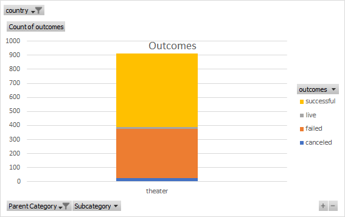
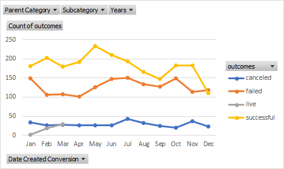
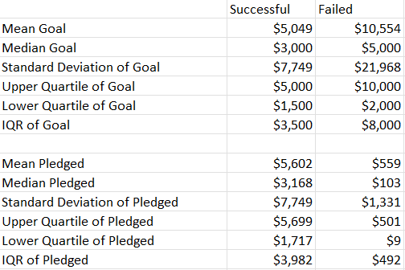

# An Analysis of Kickstarter Champaigns
Performing analysis on Kickstarter data to uncover trends in the Theater category to aid with client Louise's upcoming Play production fundraising champaign.

---
- Outcomes of Theater Champaigns

- Outcomes of Theater Champaigns by Months

- Averages for Successful/Failed Goals vs. Pledges

Link to raw data: [data-1-1-3-StarterBook.xlxs](data-1-1-3-StarterBook.xlsx)

---

Base on the analysis of Kickstarter data from the Theater Category, it is recommended that Louise target a goal of between $3000 - $5050 and begin her champaign fundraising around the April to June time frame. If these recommendations are followed, based on the data, the Theater Category is generally a success champaign.
